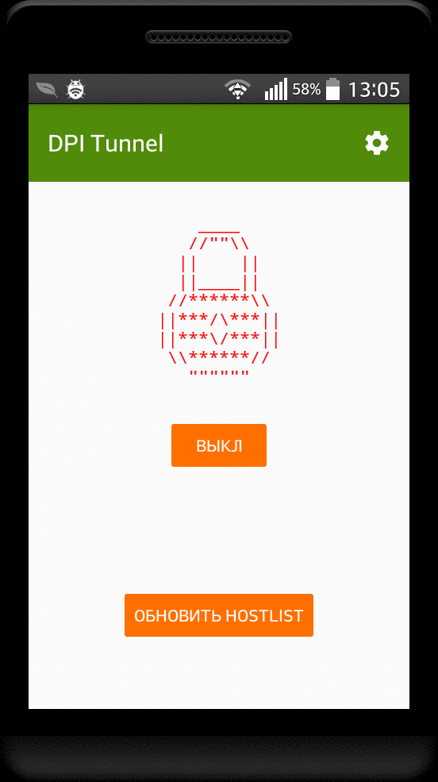

# DPI Tunnel

    

     
    

DPI Tunnel is an application for Android that uses various techniques to bypass DPI (Deep Packet Inspection) systems, which are used to block some sites.

    

## How to use

Just open the application and press the on / off button, after the local http proxy will start on the port specified in the settings.
You need to set this http proxy in the settings of your browser or system, or you can choose the "Set DPITunnel proxy globally" option in the settings and DPI Tunnel do it automatically (requires root). Also, if you do not want to set http proxy in the settings, just click &#127760; button and enter the address of the site you need in the mini-browser.

## How it works

First of all, DPI Tunnel need to manipulate traffic to bypass DPI, so DPI Tunnel starts local http proxy server and you need to use it.

### How DPI works and some methods to bypass it

###### DNS

When you enter a URL in a Web browser, the first thing the Web browser does is to ask a DNS (Domain Name System) server, at a known numeric address, to look up the domain name referenced in the URL and supply the corresponding IP address.
If the DNS server is configured to block access, it consults a blacklist of banned domain names. When a browser requests the IP address for one of these domain names, the DNS server gives a wrong answer or no answer at all.
To overcome this problem DPI Tunnel uses DNS-Over-HTTPS technology, that sends DNS request in HTTPS packets.

###### HTTPS

DPI systems look for the Server Name Indication (SNI) field in the Client Hello packet.
To bypass DPI we can send HTTPS request by parts, because MOST DPIs can't reconstruct TCP session.

###### HTTP

There is a lot of methods.
First, we can split request in packets.
Second, we can modify HTTP packet, because most DPIs can extract site address only from standard HTTP packet. For example: we can replace Host: header with hOsT: or replace DOS end of line with UNIX. Don't worry, this modifications shouldn't break any website as they're fully compatible with TCP and HTTP standards.

## License

Licensed under the MIT license. See [LICENSE](https://github.com/zhenyolka/DPITunnel/blob/master/LICENSE "LICENSE").